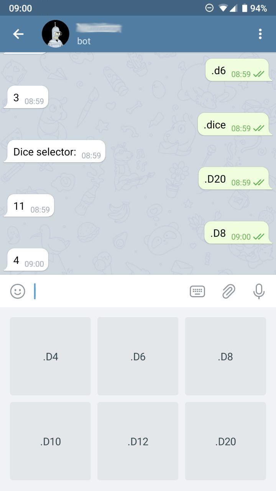

# A Telegram Bot server in Ruby on Heroku using webhooks

An example of a Ruby Telegram Bot server hosted on Heroku.

It's a simple Rack app that handle POST requests and launch dice with different sides.

## Install

- Create a new bot on Telegram writing to **@BotFather** the command `/newbot` and choose a name and a nick; it will return the access token for the bot, put it in `API_TOKEN` env variable of `.env` file (for local development)
- Setup your bot project on Heroku:
  - Create a new Ruby project
  - Set the API_TOKEN with: `heroku config:set API_TOKEN=bot_token`
  - Clone this repo and commit the changes
  - Check the logs with: `heroku logs -t`
- Set the webhook URL for the bot (replacing `API_TOKEN` and `HEROKU_PROJECT`):

```sh
curl -X POST -H 'Content-Type: application/json' 'https://api.telegram.org/botAPI_TOKEN/setWebhook' --data '{"url":"https://HEROKU_PROJECT.herokuapp.com/"}'
```

## Usage

- Write to your bot a command (ex. `.D4`)
- A POST request should be received (check the Heroku logs)
- The result should be shown in the bot channel

## Screenshot



## Do you like it? Star it!

If you use this component just star it. A developer is more motivated to improve a project when there is some interest.

## Contributors

- [Mattia Roccoberton](https://blocknot.es/): author

## License

[MIT](LICENSE.txt)
